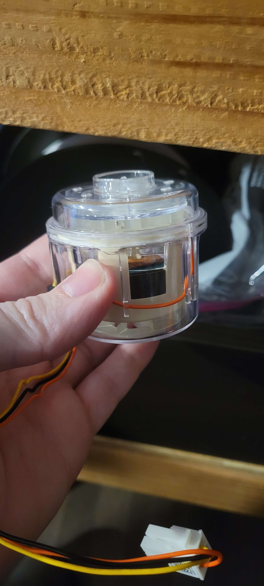

Remote Colling using a Resmed CPAP Fan 

https://github.com/runtpacket/Struggle-Bus-Labs/blob/2c862576b6ee6aff143c2e27e244c77e0f8e2bb0/Mods/CPAP%20FAN/RioRand%20300W%205-50V%20PWM%20DC%20Brushless%20Electric%20Motor%20Speed%20Controller.jpg

[RioRand 300W 5-50V PWM DC Brushless Electric Motor Speed Controller with Hall-Less](https://www.amazon.com/dp/B087M3GVYX?ref=ppx_yo2ov_dt_b_product_details&th=1)

[Fan speed controoler on amazon0(https://www.amazon.com/dp/B087M3GVYX?ref=ppx_yo2ov_dt_b_product_details&th=1)

