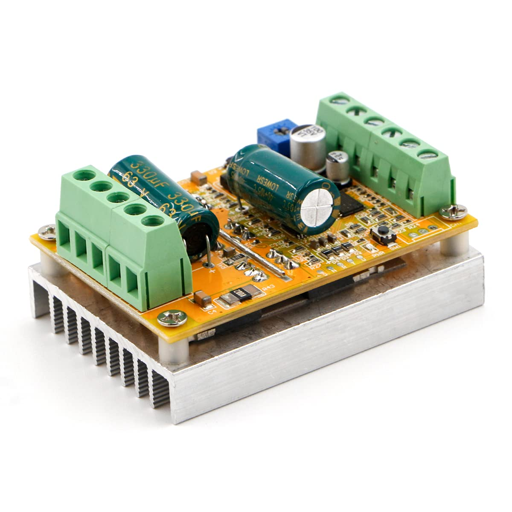
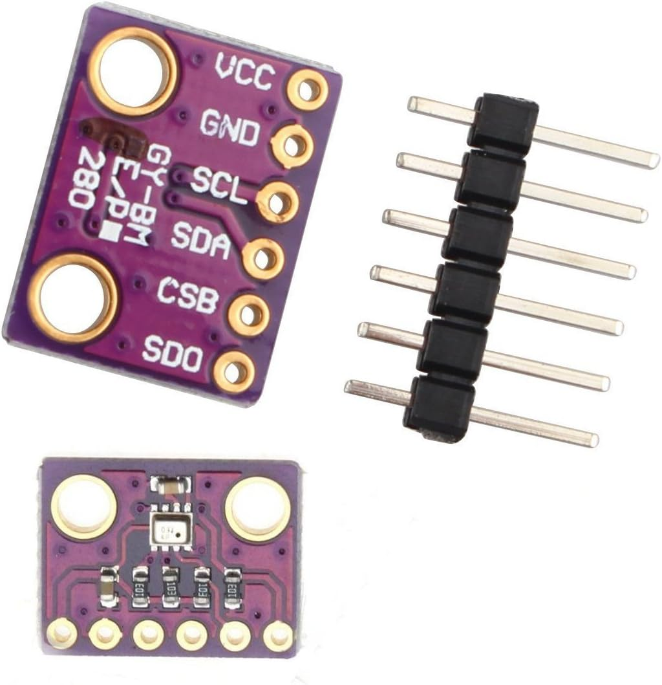

# Remote Cooling using a Resmed CPAP Fan 

This will need some tape to seal air leaks. i used 1mm foam and the base needs glued to the pump bottom.

## Requires: 


[Fan speed controller on amazon](https://www.amazon.com/dp/B087M3GVYX?ref=ppx_yo2ov_dt_b_product_details&th=1)



# Optional

[BME280 Temp Pressure Humidity Sensor](https://www.amazon.com/dp/B01N47LZ4P?psc=1&ref=ppx_yo2ov_dt_b_product_details)



## Klipper configuration. Add this to your printer.cfg
```
[fan]
pin: PB6
hardware_pwm: True
shutdown_speed: 0
kick_start_time: .25
max_power: 1 # adjust below 1 if you would like the max speed to be slower
off_below: 0.06 # minimum speed where the fan starts spinning - on octopus pro this is correct - will be lower maybe 0 on mellow Super 8 because of different GPIO pullup and protection resistors
cycle_time: .00001 # = 2khz - CPAP fan driver recommended range is 2-50khz
#tachometer_pin:^PG13
#tachometer_ppr: 2
```


